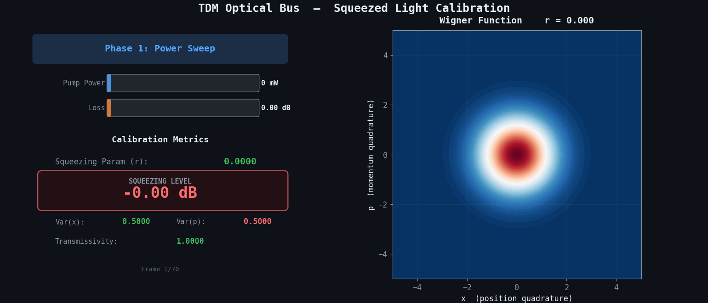
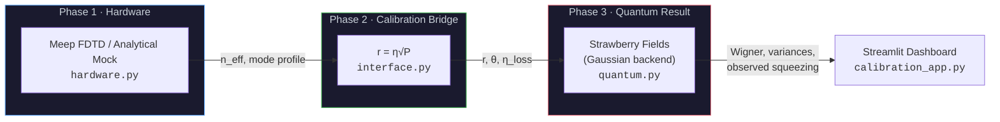

# Quantum Optical Bus — Calibration Dashboard

[](https://github.com/KumaHoon/Quantum-Optical-Bus-Simulation/actions/workflows/ci.yml)

A hybrid quantum-classical simulation demonstrating **"One Waveguide (Hardware), Infinite States (Software)"** — with a **Calibration Dashboard** that maps classical FDTD parameters to continuous-variable (CV) quantum states via a transparent squeezing calibration $r = \eta\sqrt{P}$.

---

## 🎬 Live Demo

The dashboard sweeps pump power from 0 → 200 mW (squeezed ellipse forms), then increases propagation loss from 0 → 2 dB (decoherence restores the circular vacuum shape). **Loss does not change intrinsic *r*; it reduces observed squeezing (post-loss).**



> **Figure 1: Real-time Calibration Simulation.**
> The GIF shows both **intrinsic squeezing (pre-loss)** — constant for a given pump power — and **observed squeezing (post-loss)** — which decreases as propagation loss increases. This visually verifies the $r \propto \sqrt{P}$ mapping and the decoherence effect of the pure-loss channel.

---

## 🏗️ Architecture



| Layer | File | Responsibility |
|-------|------|----------------|
| **Hardware** | `hardware.py` | LN Ridge Waveguide mode simulation (Meep / analytical mock) |
| **Interface** | `interface.py` | Pump power → squeezing parameter mapping ($r = \eta\sqrt{P}$) |
| **Quantum** | `quantum.py` | Single-mode Gaussian circuit (Sgate + LossChannel → Wigner, eigenvalues) |
| **Compat** | `compat.py` | Dependency patches (pkg_resources, scipy) |
| **Dashboard** | `calibration_app.py` | Streamlit calibration UI orchestrating all layers |

---

## 🔬 Calibration Dashboard

The dashboard follows a three-phase flow: **Hardware → Calibration → Quantum Result**.

### Phase 1 · The Device (LN Ridge Waveguide)
A Lithium Niobate waveguide at 1550 nm simulated via Meep FDTD (falls back to analytical Gaussian mode).

### Phase 2 · The Calibration Bridge
The core of the presentation — live LaTeX formulas showing:
- **Squeezing parameter:** $r = \eta \sqrt{P}$
- **Intrinsic squeezing (pre-loss):** $-10\log_{10}(e^{-2r})$ dB — depends only on pump power
- **Observed squeezing (post-loss):** from output covariance eigenvalues after the loss channel
- Interactive calibration curve with current operating point

### Phase 3 · Quantum Result
Three tabbed visualizations:
- **Wigner Function** — contour plot (becomes "fuzzier" with loss → decoherence)
- **Photon Number Distribution** — even-photon pairing from squeezed vacuum
- **Noise Variance** — squeezed/anti-squeezed quadratures vs shot noise limit

---

## 📸 Scenario Gallery

| Scenario | Image |
|----------|-------|
| **1. Vacuum Baseline** (P = 0 mW) |  |
| **2. Squeezed State** (P = 200 mW) |  |
| **3. Decoherence** (Pure vs Lossy) |  |

---

## 🚀 Quick Start

```bash
# Install
pip install -e .

# Launch dashboard
streamlit run src/quantum_optical_bus/calibration_app.py
```

Open **http://localhost:8501** and use the sidebar sliders to adjust pump power, phase, and loss — watch the quantum state update in real-time.

<details>
<summary>🇯🇵 日本語</summary>

```bash
pip install -e .
streamlit run src/quantum_optical_bus/calibration_app.py
```
ブラウザで **http://localhost:8501** を開き、サイドバーのスライダーでポンプ出力・位相・損失を調整すると、量子状態がリアルタイムで変化します。
</details>

<details>
<summary>🇰🇷 한국어</summary>

```bash
pip install -e .
streamlit run src/quantum_optical_bus/calibration_app.py
```
브라우저에서 **http://localhost:8501** 을 열고, 사이드바 슬라이더로 펌프 출력, 위상, 손실을 조정하면 양자 상태가 실시간으로 변화합니다.
</details>

### Additional Commands

| Task | Command |
|------|---------|
| Generate Gallery Images | `python scripts/generate_dashboard_gallery.py` |
| Generate Demo GIF | `python scripts/generate_calibration_demo.py` |

---

## 📐 Model Definitions and Assumptions

### Squeezing parameter — source knob

The squeezing parameter **r** is a phenomenological mapping from pump power:

$$r = \eta \sqrt{P}$$

where $\eta = 0.1$ is a coupling efficiency placeholder (tuned so 100 mW → r ≈ 1.0).
This is a **source-level knob** — it controls how much squeezing the nonlinear process
generates, independent of any downstream losses.

### Loss model

Propagation and detection losses are modelled as a **separate pure-loss channel**
applied *after* squeezing.  The channel transmissivity is:

$$T = 10^{-\text{loss\_dB}/10}$$

This corresponds to a beam-splitter mixing the signal with vacuum:

$$\hat{a}_{\text{out}} = \sqrt{T}\,\hat{a}_{\text{in}} + \sqrt{1-T}\,\hat{a}_{\text{vac}}$$

### Intrinsic vs Observed squeezing

| Metric | Definition | Depends on loss? |
|--------|-----------|-----------------|
| **Intrinsic squeezing (pre-loss)** | $-10\log_{10}(e^{-2r})$ — computed from *r* only | No |
| **Observed squeezing (post-loss)** | $-10\log_{10}(V_{\min}/V_{\text{vac}})$ — from output covariance eigenvalues | Yes |

Analytic intuition (single-mode Gaussian):

$$V_{\text{out}} = T \cdot V_{\text{in}} + (1-T) \cdot V_{\text{vac}}, \quad V_{\text{vac}} = \tfrac{1}{2}$$

As $T \to 0$ (total loss), $V_{\text{out}} \to V_{\text{vac}}$ and observed squeezing → 0 dB.

### Honest notes about placeholders

- **Coupling efficiency** ($\eta$): currently a fixed constant.  In a real device this
  would be calibrated from overlap integrals; tuning infrastructure is stubbed out.
- **Meep FDTD**: the hardware layer falls back to an analytical Gaussian mode profile
  when Meep is not installed.  The mode data is qualitatively correct but not
  quantitatively validated against full 3-D FDTD.
- **Time-bin scope**: each time bin is simulated as an independent single-mode state.
  Inter-bin coupling (e.g., via shared pump or cross-phase modulation) is **not**
  implemented — results assume perfectly isolated bins.

---

## 🧪 Testing & CI

Tests run on **Ubuntu, Windows, and macOS** via GitHub Actions:

```bash
pip install -e ".[test]"
pytest tests/ -v
```

---

## 📁 Project Structure

```
├── .github/workflows/ci.yml           # CI: Ubuntu / Windows / macOS
├── src/quantum_optical_bus/
│   ├── calibration_app.py              # Streamlit Calibration Dashboard
│   ├── quantum.py                      # Shared single-mode Gaussian circuit
│   ├── hardware.py                     # Meep / analytical mock
│   ├── interface.py                    # Power → Squeezing mapping
│   └── compat.py                       # Dependency patches
├── tests/test_core.py                  # Pytest suite (13 tests)
├── scripts/
│   ├── generate_calibration_demo.py    # Animated demo GIF
│   └── generate_dashboard_gallery.py   # Dashboard scenario images
└── assets/                             # Generated images & demo
```
